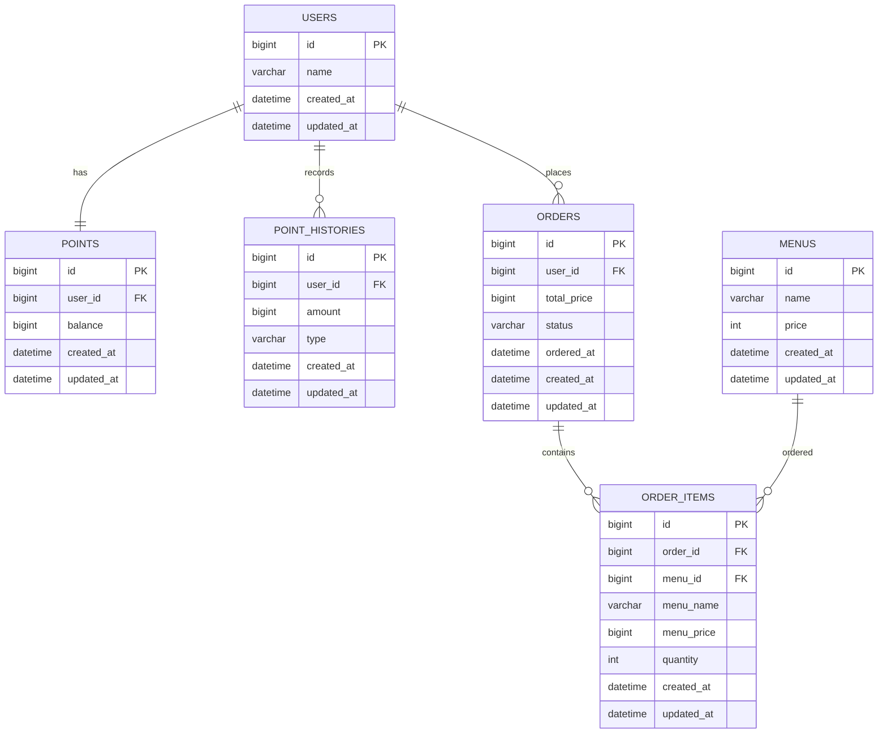

# Coffee Order System

다수 서버 환경에서도 포인트 정합성을 유지할 수 있도록 DB 비관적 락 기반으로 설계한 커피숍 주문 시스템입니다. 커피 메뉴 조회, 포인트 충전, 커피 주문/결제, 최근 7일 인기 메뉴 조회 API를 제공합니다.

결제는 포인트로만 가능하며 `1원 = 1P`로 처리합니다. 주문 성공 내역은 데이터 수집 플랫폼으로 전송해야 하는 요구사항이 있으며, 이 프로젝트에서는 실제 외부 API 대신 `OrderDataPlatformClient`와 `MockOrderDataPlatformClient`로 전송 구조를 대체했습니다. 전송은 주문 트랜잭션이 성공적으로 커밋된 이후 `@TransactionalEventListener(phase = TransactionPhase.AFTER_COMMIT)`를 통해 수행되므로, 주문 트랜잭션이 롤백되면 데이터 수집 플랫폼으로 전송되지 않습니다.

## 주요 기능

- 커피 메뉴 목록 조회
- 사용자 포인트 충전
- 커피 주문 및 포인트 결제
- 최근 7일 인기 메뉴 Top 3 조회
- 주문 데이터 수집 플랫폼 Mock 전송
- 공통 예외 처리
- 포인트 변경 동시성 제어
- Controller/Service 테스트와 동시성 테스트

## 요구사항 구현 여부

| 구분 | 요구사항 | 구현 여부 | 설명 |
|---|---|---|---|
| 필수 | 메뉴 목록 조회 API | ✅ | 메뉴 ID, 이름, 가격 조회 |
| 필수 | 포인트 충전 API | ✅ | 사용자 식별값과 충전 금액으로 포인트 충전 |
| 필수 | 주문/결제 API | ✅ | 포인트 차감 후 주문 생성 |
| 필수 | 인기 메뉴 조회 API | ✅ | 최근 7일간 주문 기준 Top 3 조회 |
| 필수 | 주문 데이터 실시간 전송 | ✅ | 주문 트랜잭션 커밋 후 이벤트 리스너를 통해 Mock Client로 전송 |
| 도전 | 다수 서버 환경 고려 | ✅ | DB 비관적 락 기반 포인트 정합성 제어 |
| 도전 | 동시성 이슈 고려 | ✅ | 포인트 충전/주문 동시 요청 시 같은 사용자 Point row에 쓰기 락 적용 |
| 도전 | 데이터 일관성 고려 | ✅ | 포인트 충전과 주문/결제를 트랜잭션으로 처리 |
| 도전 | 테스트 작성 | ✅ | 주요 기능, 예외 상황, 동시성 상황 테스트 |

## 기술 스택

- Java 17
- Spring Boot 3.5.14
- Spring Web
- Spring Data JPA
- Spring Validation
- H2 Database
- MySQL Connector
- Gradle
- Lombok
- JUnit 5
- AssertJ
- MockMvc

## 프로젝트 구조

```text
src/main/java/com/example/coffeeordersystem
├── CoffeeOrderSystemApplication.java
├── domain
│   ├── menu
│   │   ├── controller
│   │   ├── dto/response
│   │   ├── entity
│   │   ├── repository
│   │   └── service
│   ├── order
│   │   ├── client
│   │   ├── controller
│   │   ├── dto/request
│   │   ├── dto/response
│   │   ├── entity
│   │   ├── event
│   │   ├── repository
│   │   └── service
│   ├── point
│   │   ├── controller
│   │   ├── dto/request
│   │   ├── dto/response
│   │   ├── entity
│   │   ├── repository
│   │   └── service
│   └── user
│       ├── entity
│       └── repository
├── external
│   └── dataplatform
└── global
    ├── common
    ├── config
    └── exception
```

## ERD



※ `POINTS.user_id`에는 unique 제약을 두어 사용자별 포인트 row가 하나만 생성되도록 설계했습니다.

## API 명세

공통 응답은 `ApiResponse<T>`를 사용합니다.

```json
{
  "success": true,
  "data": {},
  "message": "처리 메시지"
}
```

### 메뉴 목록 조회

- Method: `GET`
- URL: `/api/menus`
- Request: 없음
- Response 예시:

```json
{
  "success": true,
  "data": [
    {
      "menuId": 1,
      "name": "아메리카노",
      "price": 4500
    }
  ],
  "message": "메뉴 목록 조회에 성공했습니다."
}
```

### 포인트 충전

- Method: `POST`
- URL: `/api/points/charge`
- Request:

```json
{
  "userId": 1,
  "amount": 10000
}
```

- Response 예시:

```json
{
  "success": true,
  "data": {
    "userId": 1,
    "chargedAmount": 10000,
    "currentBalance": 15000
  },
  "message": "포인트 충전에 성공했습니다."
}
```

### 주문 및 결제

- Method: `POST`
- URL: `/api/orders`
- Request:

```json
{
  "userId": 1,
  "menuId": 1
}
```

- Response 예시:

```json
{
  "success": true,
  "data": {
    "orderId": 1,
    "userId": 1,
    "menuId": 1,
    "paymentAmount": 4500,
    "currentBalance": 5500,
    "status": "COMPLETED"
  },
  "message": "주문이 완료되었습니다."
}
```

### 인기 메뉴 조회

- Method: `GET`
- URL: `/api/menus/popular`
- Request: 없음
- Response 예시:

```json
{
  "success": true,
  "data": [
    {
      "menuId": 1,
      "name": "아메리카노",
      "price": 4500,
      "orderCount": 4
    }
  ],
  "message": "인기 메뉴 목록 조회에 성공했습니다."
}
```

### 실패 응답 예시

```json
{
  "success": false,
  "data": null,
  "message": "포인트 잔액이 부족합니다."
}
```

## 설계 의도

도메인은 `menu`, `user`, `point`, `order`로 분리했습니다. 각 도메인의 책임을 분리해 메뉴 조회, 포인트 관리, 주문 결제, 사용자 식별 로직이 서로 과하게 결합되지 않도록 했습니다.

포인트는 `User`에 직접 두지 않고 `Point` 엔티티로 분리했습니다. 사용자는 식별 정보만 담당하고, 포인트 잔액과 변경 규칙은 `Point`가 담당합니다. 포인트 충전과 사용 이력은 `PointHistory`에 저장해 잔액 변경의 근거를 남깁니다.

주문은 `Order`와 `OrderItem`으로 나누었습니다. 현재 API는 단일 메뉴 주문이지만, `OrderItem`을 두면 여러 메뉴 주문으로 확장하기 쉽고 주문 당시 메뉴명과 가격을 보존할 수 있습니다.

인기 메뉴는 주문 성공 시 저장된 `OrderItem`을 기준으로 조회합니다. 별도 집계 테이블 없이 최근 7일간 완료 주문 데이터를 DB에서 집계해 정확한 주문 횟수를 계산합니다.

공통 응답은 `ApiResponse`로 통일했습니다. 성공/실패 응답의 형태를 일정하게 유지해 클라이언트가 동일한 방식으로 응답을 처리할 수 있습니다.

예외 처리는 `BusinessException`, `ErrorCode`, `GlobalExceptionHandler`로 분리했습니다. 서비스나 엔티티에서 도메인 예외를 발생시키면 전역 핸들러가 HTTP 응답으로 변환합니다.

`BaseEntity`와 JPA Auditing을 사용해 주요 엔티티의 `createdAt`, `updatedAt`을 공통 관리합니다. `Order.orderedAt`은 생성 시간이 아니라 주문 발생 시각이라는 비즈니스 필드이므로 별도로 유지했습니다.

## 문제 해결 전략

포인트 충전은 사용자 포인트 잔액을 증가시키는 작업입니다. 같은 사용자가 동시에 충전하면 lost update가 발생할 수 있으므로 `PointRepository.findByUserId()`에 비관적 락을 적용했습니다.

주문/결제는 주문 생성과 포인트 차감이 함께 일어나는 작업입니다. 포인트 차감, 포인트 사용 이력 저장, 주문 저장, 주문 아이템 저장을 하나의 트랜잭션으로 묶어 일부만 성공하는 상황을 방지했습니다.

포인트가 부족하면 `Point.use()`에서 `INSUFFICIENT_POINT` 예외가 발생합니다. 이 경우 주문 저장과 포인트 차감은 트랜잭션 롤백 대상이므로 주문이 생성되지 않습니다.

인기 메뉴는 최근 7일간 `COMPLETED` 상태 주문의 `OrderItem`을 기준으로 집계합니다. `OrderItemRepository`에서 JPQL group by 쿼리와 `PageRequest.of(0, 3)`을 사용해 주문 수 내림차순, 메뉴 ID 오름차순으로 상위 3개를 조회합니다.

주문 데이터 수집 플랫폼 전송은 `OrderDataPlatformClient` 인터페이스로 분리했습니다. `OrderService`는 주문 성공 이벤트를 발행하고, `OrderDataPlatformEventListener`가 `@TransactionalEventListener(phase = TransactionPhase.AFTER_COMMIT)`로 트랜잭션 커밋 이후 Mock Client를 호출합니다. 트랜잭션이 롤백되면 이벤트 리스너가 실행되지 않으므로 데이터 수집 플랫폼으로 전송되지 않습니다.

## 동시성 처리 방식

포인트 잔액 조회에는 DB 비관적 락을 사용합니다.

```java
@Lock(LockModeType.PESSIMISTIC_WRITE)
Optional<Point> findByUserId(Long userId);
```

포인트 충전 로직과 주문/결제 로직은 모두 위 메서드를 사용해 같은 사용자의 `points` row를 쓰기 락으로 조회합니다. 먼저 락을 잡은 트랜잭션이 끝날 때까지 다음 트랜잭션이 대기하므로 잔액 검증과 충전/차감이 순차적으로 처리됩니다.

`synchronized`는 단일 JVM 내부에서만 동작하므로 다수 서버 환경에서는 한계가 있습니다. 이 프로젝트는 DB row lock을 사용해 여러 인스턴스에서도 동일 row에 대한 정합성을 확보하는 방향으로 설계했습니다.

`Point`와 `User`는 `@OneToOne` 관계이며 `points.user_id`에는 `unique = true` 제약을 두었습니다. 이를 통해 사용자별 포인트 row가 중복 생성되지 않도록 방지합니다.

## 트랜잭션 / 데이터 일관성

서비스 계층은 기본적으로 클래스 레벨에 `@Transactional(readOnly = true)`를 적용해 조회 작업을 기본 모드로 두었습니다. 이를 통해 조회 메서드에서는 JPA 변경 감지 비용을 줄이고, 새로 추가되는 메서드가 의도치 않게 데이터를 변경하는 상황을 방지할 수 있습니다.

포인트 충전, 주문/결제처럼 데이터 변경이 필요한 메서드에는 메서드 레벨에 별도의 `@Transactional`을 적용했습니다. 이를 통해 쓰기 작업임을 명확히 드러내고, 포인트 차감, 이력 저장, 주문 저장이 하나의 트랜잭션 안에서 함께 성공하거나 실패하도록 보장했습니다.

`PointService.chargePoint()`는 쓰기 트랜잭션으로 동작합니다. 사용자 조회, 포인트 조회/생성, 포인트 충전, 충전 이력 저장이 하나의 트랜잭션으로 처리됩니다.

`OrderService.createOrder()`도 쓰기 트랜잭션으로 동작합니다. 사용자 조회, 메뉴 조회, 포인트 조회, 포인트 차감, 포인트 사용 이력 저장, 주문 저장, 주문 아이템 저장, 주문 성공 이벤트 발행이 같은 트랜잭션 안에서 처리됩니다. 실제 데이터 수집 플랫폼 전송은 트랜잭션 커밋 이후 이벤트 리스너에서 수행됩니다.

주문 생성과 포인트 차감은 함께 성공하거나 함께 실패해야 합니다. 포인트 부족, 존재하지 않는 사용자, 존재하지 않는 메뉴, 포인트 정보 없음 등의 예외가 발생하면 트랜잭션이 롤백되어 주문 데이터가 남지 않습니다.

`MenuService`는 조회 중심 서비스이므로 클래스 레벨의 read-only 트랜잭션만 사용합니다. `PointService`, `OrderService`는 클래스 레벨 read-only를 기본값으로 두고, 데이터 변경이 필요한 메서드만 메서드 레벨 `@Transactional`로 override합니다.

## 예외 처리

| 예외 상황 | ErrorCode | HTTP Status | 설명 |
|---|---|---|---|
| 존재하지 않는 사용자 | `USER_NOT_FOUND` | 404 | 포인트 충전 또는 주문 시 사용자 없음 |
| 존재하지 않는 메뉴 | `MENU_NOT_FOUND` | 404 | 주문 시 메뉴 없음 |
| 포인트 정보 없음 | `POINT_NOT_FOUND` | 404 | 주문 결제 시 사용자 포인트 정보 없음 |
| 0 이하 충전 금액 | `INVALID_CHARGE_AMOUNT` | 400 | 포인트 충전 금액 검증 실패 |
| 잘못된 포인트 잔액 | `INVALID_POINT_BALANCE` | 400 | 음수 잔액 Point 생성 방지 |
| 포인트 부족 | `INSUFFICIENT_POINT` | 400 | 주문 결제 가능 잔액 부족 |
| 잘못된 결제 금액 | `INVALID_PAYMENT_AMOUNT` | 400 | 0 이하 주문 결제 금액 |
| 데이터 플랫폼 전송 실패 | `DATA_PLATFORM_SEND_FAILED` | 500 | 주문 데이터 수집 플랫폼 전송 실패 |
| 잘못된 요청값 | `INVALID_REQUEST` | 400 | DTO validation 실패 |
| 처리되지 않은 서버 오류 | `INTERNAL_SERVER_ERROR` | 500 | 알 수 없는 서버 예외 |

## 테스트

주요 기능과 예외 상황에 대해 Controller/Service 테스트를 작성했고, 포인트 충전과 주문의 동시성 상황을 별도 테스트로 검증했습니다.

| 테스트 대상 | 테스트 내용 |
|---|---|
| `CoffeeOrderSystemApplicationTests` | Spring Context 로드 |
| `MenuControllerTest` | 메뉴 목록 조회 성공, 메뉴 없음 빈 배열 반환 |
| `MenuControllerTest` | 최근 7일 인기 메뉴 Top 3 조회, 주문 없음 빈 배열 반환 |
| `PointControllerTest` | 포인트 충전 성공 응답 |
| `PointControllerTest` | 0원 충전 요청 실패 응답 |
| `PointControllerTest` | 존재하지 않는 사용자 충전 실패 응답 |
| `PointServiceTest` | 포인트 충전 성공 |
| `PointServiceTest` | 존재하지 않는 사용자 예외 |
| `PointServiceTest` | 0 이하 충전 금액 예외 |
| `PointServiceTest` | 충전 시 `PointHistory.CHARGE` 저장 |
| `PointServiceTest` | 같은 사용자 동시 충전 시 잔액 정합성 검증 |
| `OrderControllerTest` | 주문 성공 응답 |
| `OrderControllerTest` | 존재하지 않는 메뉴 주문 실패 응답 |
| `OrderControllerTest` | 포인트 부족 주문 실패 응답 |
| `OrderServiceTest` | 주문 성공, 주문/주문아이템 저장 |
| `OrderServiceTest` | 포인트 부족 예외, 메뉴 없음 예외 |
| `OrderServiceTest` | 주문 성공 시 포인트 차감 |
| `OrderServiceTest` | 주문 성공 시 `PointHistory.USE` 저장 |
| `OrderServiceTest` | 주문 성공 후 데이터 플랫폼 전송 호출 |
| `OrderServiceTest` | 같은 사용자 동시 주문 시 잔액 정합성 검증 |

## 실행 방법

애플리케이션 실행:

```bash
./gradlew bootRun
```

Windows:

```bash
gradlew.bat bootRun
```

테스트 실행:

```bash
./gradlew test
```

Windows:

```bash
gradlew.bat test
```

기본 서버 포트는 `8080`이며, H2 Console은 `/h2-console`에서 확인할 수 있습니다.

## 보완 가능 사항

- 최초 포인트 row가 없는 사용자의 동시 충전 상황은 unique 제약으로 중복 생성을 방지하고 있으며, 운영 환경에서는 재시도 전략을 추가할 수 있습니다.
- 실제 외부 데이터 수집 플랫폼 연동 시에는 Outbox 패턴 또는 메시지 큐를 도입해 전송 실패 재처리를 보완할 수 있습니다.

## 📝 트러블슈팅 & TIL

과제 진행 중 고민했던 동시성, 트랜잭션, 데이터 일관성 관련 트러블슈팅은 아래 글에 정리했습니다.

- [커피 주문 시스템 과제 TIL](https://aspiring-backend.tistory.com/13)
